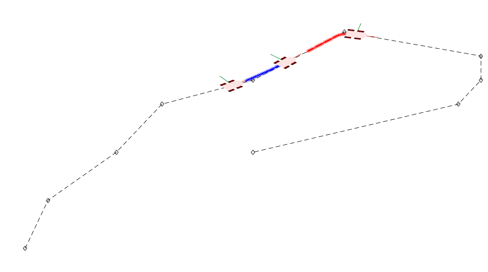

# platooning_simple_simulation
This is a very simple implementation of platooning in matlab. The follower is controlled with angular and linear PID controllers, and each vehicle emits waypoints for following vehicles to pursue. The linear controller ensures that the vehicles maintain a reasonable separation.

